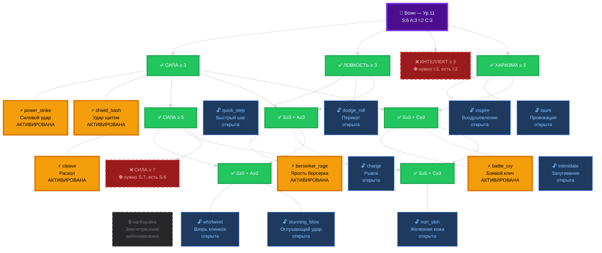
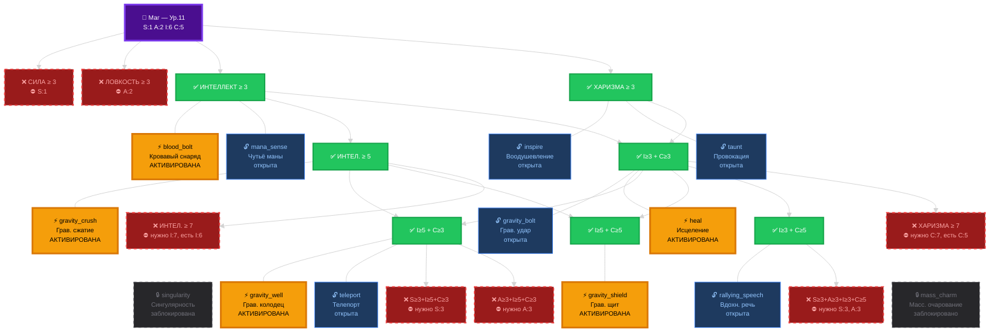
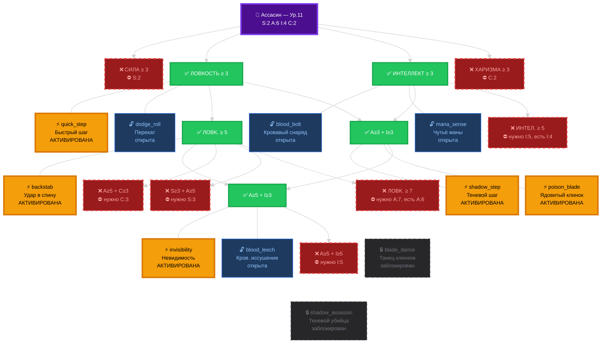

# Дерево способностей — Визуальный граф

> Для просмотра: `Ctrl+Shift+V` (Markdown Preview) — нужно расширение **Markdown Preview Mermaid Support**.

```mermaid
%%{init: {'theme': 'dark', 'themeVariables': {'fontSize': '12px'}, 'flowchart': {'nodeSpacing': 20, 'rankSpacing': 60}}}%%
flowchart TD
    START["🎲 СТАРТОВЫЕ ОЧКИ: 4<br/>S:1 A:1 I:1 C:1"]

    %% ═══════════ ТИР 1 — Базовые ═══════════
    START --> S3["⚔️ СИЛА ≥ 3"]
    START --> A3["🏹 ЛОВКОСТЬ ≥ 3"]
    START --> I3["🔮 ИНТЕЛЛЕКТ ≥ 3"]
    START --> C3["👑 ХАРИЗМА ≥ 3"]

    S3 --- ps["power_strike<br/>Силовой удар<br/>2AP ×1.5 урон"]
    S3 --- sb["shield_bash<br/>Удар щитом<br/>2AP оглуш. 1 ход"]

    A3 --- qs["quick_step<br/>Быстрый шаг<br/>1AP +3 MP"]
    A3 --- dr["dodge_roll<br/>🛡 Перекат<br/>PASS +2 уклон."]

    I3 --- fb["blood_bolt<br/>Кровавый снаряд<br/>2AP d8+INT-2HP"]
    I3 --- ms["mana_sense<br/>🛡 Чутьё маны<br/>PASS +2 воспр."]

    C3 --- ins["inspire<br/>Воодушевление<br/>2AP +1AP союзн."]
    C3 --- tau["taunt<br/>Провокация<br/>1AP таунт 2 хода"]

    %% ═══════════ ТИР 2 — Продвинутые ═══════════
    S3 --> S5["⚔️ СИЛА ≥ 5"]
    S3 --> SA["⚔️🏹 S≥3 + A≥3"]
    S3 --> SC["⚔️👑 S≥3 + C≥3"]
    A3 --> SA
    A3 --> A5["🏹 ЛОВК. ≥ 5"]
    A3 --> AI["🏹🔮 A≥3 + I≥3"]
    I3 --> AI
    I3 --> I5["🔮 ИНТЕЛ. ≥ 5"]
    I3 --> IC["🔮👑 I≥3 + C≥3"]
    C3 --> SC
    C3 --> IC

    S5 --- cl["cleave<br/>Раскол<br/>3AP 2 цели"]

    SA --- br["berserker_rage<br/>Ярость берсерка<br/>2AP +50%урон 3 хода"]
    SA --- ch["charge<br/>Рывок<br/>3AP прыжок+удар"]

    A5 --- bs["backstab<br/>Удар в спину<br/>2AP ×2 урона"]

    AI --- ss["shadow_step<br/>Теневой шаг<br/>2AP телепорт 2кл"]
    AI --- pb["poison_blade<br/>Ядовитый клинок<br/>2AP яд 3 хода"]

    I5 --- fball["gravity_crush<br/>Грав. сжатие<br/>3AP AoE r2"]

    IC --- is["gravity_bolt<br/>Грав. удар<br/>2AP d8+INT+притяг."]
    IC --- heal["heal<br/>Исцеление<br/>2AP 5+INT×1.5 HP"]

    SC --- bc["battle_cry<br/>Боевой клич<br/>2AP +2урон 2кл"]
    SC --- intim["intimidate<br/>Запугивание<br/>2AP -1AP враг"]

    %% ═══════════ ТИР 3 — Экспертные ═══════════
    S5 --> S5A3["⚔️🏹 S≥5 + A≥3"]
    S5 --> S5C3["⚔️👑 S≥5 + C≥3"]
    SA --> S5A3
    A5 --> A5I3["🏹🔮 A≥5 + I≥3"]
    A5 --> A5C3["🏹👑 A≥5 + C≥3"]
    A5 --> S3A5["⚔️🏹 S≥3 + A≥5"]
    AI --> A5I3
    I5 --> I5C3["🔮👑 I≥5 + C≥3"]
    I5 --> I5C5["🔮👑 I≥5 + C≥5"]
    IC --> I5C3
    IC --> I5C5
    IC --> I3C5["🔮👑 I≥3 + C≥5"]
    SC --> S5C3

    S5A3 --- ww["whirlwind<br/>Вихрь клинков<br/>3AP AoE 1кл"]
    S5A3 --- stb["stunning_blow<br/>Оглушающий удар<br/>3AP 100%оглуш."]

    S5C3 --- isk["iron_skin<br/>🛡 Железная кожа<br/>PASS +3 блок"]

    A5I3 --- inv["invisibility<br/>Невидимость<br/>2AP 3 хода"]
    A5I3 --- chl["blood_leech<br/>Кров. иссушение<br/>3AP 3 цели+50%хил"]

    A5C3 --- ev["evasion_master<br/>🛡 Мастер уклон.<br/>PASS +3 уклон."]
    A5C3 --- dis["disguise<br/>Маскировка<br/>2AP копия облика"]

    I5C3 --- ist["gravity_well<br/>Грав. колодец<br/>3AP AoE стяг."]
    I5C3 --- tp["teleport<br/>Телепорт<br/>2AP любая клетка"]

    I5C5 --- ash["gravity_shield<br/>🛡 Грав. щит<br/>PASS -5 дальн."]

    I3C5 --- rs["rallying_speech<br/>Вдохн. речь<br/>3AP +3HP+1AP 3кл"]

    S3A5 --- ca["counter_attack<br/>🛡 Контратака<br/>PASS 30% ответ"]

    %% ═══════════ ТИР 4 — Мастерские ═══════════
    S5 --> S7["⚔️⚔️ СИЛА ≥ 7"]
    A5 --> A7["🏹🏹 ЛОВК. ≥ 7"]
    I5 --> I7["🔮🔮 ИНТЕЛ. ≥ 7"]
    IC --> C7["👑👑 ХАРИЗМА ≥ 7"]
    S5 --> S5I5["⚔️🔮 S≥5 + I≥5"]
    A5I3 --> A5I5["🏹🔮 A≥5 + I≥5"]
    S5C3 --> S5C5["⚔️👑 S≥5 + C≥5"]
    A5C3 --> A5C5["🏹👑 A≥5 + C≥5"]
    S5C3 --> S5I3C3["⚔️🔮👑 S≥5+I≥3+C≥3"]
    I5C3 --> S3I5C3["⚔️🔮👑 S≥3+I≥5+C≥3"]
    I5C3 --> A3I5C3["🏹🔮👑 A≥3+I≥5+C≥3"]
    I3C5 --> SAIC5["⚔️🏹🔮👑 S≥3+A≥3+I≥3+C≥5"]

    S7 --- eq["earthquake<br/>Землетрясение<br/>4AP AoE 3кл"]
    A7 --- bd["blade_dance<br/>Танец клинков<br/>4AP 3 удара"]
    I7 --- mt["singularity<br/>Сингулярность<br/>4AP AoE 3кл стяг."]
    C7 --- mc["mass_charm<br/>Масс. очарование<br/>4AP skip 2кл"]

    S5I5 --- phx["blood_rage<br/>Кровав. ярость<br/>3AP ×3-25%HP"]
    A5I5 --- sha["shadow_assassin<br/>🛡 Теневой убийца<br/>PASS ×3 крит невид."]
    S5C5 --- pal["paladin_aura<br/>🛡 Аура паладина<br/>PASS +2блок+2HP/ход"]
    A5C5 --- trg["trickster_gambit<br/>Гамбит трикстера<br/>2AP swap 5кл"]

    S5I3C3 --- dmr["damage_reflect<br/>🛡 Отражение урона<br/>PASS 20% reflect"]
    S3I5C3 --- reg["regeneration<br/>🛡 Регенерация<br/>PASS +3 HP/ход"]
    A3I5C3 --- ish["gravity_anchor<br/>🛡 Грав. якорь<br/>PASS -3урон+иммун."]
    SAIC5 --- btc["battle_commander<br/>Полководец<br/>5AP доп. ход всем"]

    %% ═══════════ ТИР S — Синергии (пунктирные связи от способностей) ═══════════
    fb -.-> bga["🔗 blood_gravity_arrow<br/>Кровавая грав. стрела<br/>3AP d12+вампиризм 30%"]
    is -.-> bga

    chl -.-> bvx["🔗 blood_vortex<br/>Кровавая воронка<br/>4AP AoE стяг.+хил"]
    ist -.-> bvx

    mt -.-> gst["🔗 gravity_storm<br/>Грав. буря<br/>5AP AoE 4кл 3 хода"]
    ist -.-> gst

    is -.-> gbl["🔗 gravitational_blade<br/>Грав. клинок<br/>3AP притяг+удар ×2.5"]
    bs -.-> gbl

    ss -.-> wst["🔗 warp_strike<br/>Варп-удар<br/>4AP телепорт+AoE грав."]
    fball -.-> wst

    isk -.-> imf["🔗 immovable_fortress<br/>🛡 Несокруш. крепость<br/>PASS −5урон+отраж.10%"]
    ish -.-> imf

    phx -.-> bfr["🔗 blood_frenzy<br/>Кровавое безумие<br/>4AP ×4 урон 2 удара"]
    br -.-> bfr

    inv -.-> phs["🔗 phantom_strike<br/>Фантомный удар<br/>3AP крит ×3+оглуш."]
    bs -.-> phs

    inv -.-> shg["🔗 shadow_gravity<br/>Теневой коллапс<br/>4AP AoE грав. ×2"]
    fball -.-> shg

    fb -.-> btr["🔗 blood_transfusion<br/>Переливание крови<br/>2AP −30%HP → ×2 хил"]
    heal -.-> btr

    BLOOD_DRAIN_NODE["blood_drain<br/>Кров. иссушение<br/>(T3 A≥3 I≥5)"]
    BLOOD_DRAIN_NODE -.-> bpc["🔗 blood_pact<br/>Кровавый договор<br/>4AP −20%HP → +3AP всем"]
    rs -.-> bpc

    pal -.-> wav["🔗 war_avatar<br/>Аватар войны<br/>5AP ульта поддержки"]
    btc -.-> wav

    %% ═══════════ Стили ═══════════
    classDef start fill:#4a0e8f,stroke:#7c3aed,color:#fff,stroke-width:3px
    classDef tier1 fill:#1e3a5f,stroke:#3b82f6,color:#fff,stroke-width:2px
    classDef tier2 fill:#1a4731,stroke:#22c55e,color:#fff,stroke-width:2px
    classDef tier3 fill:#6b3410,stroke:#f97316,color:#fff,stroke-width:2px
    classDef tier4 fill:#6b1024,stroke:#ef4444,color:#fff,stroke-width:2px
    classDef ability fill:#1e1e2e,stroke:#6c7086,color:#cdd6f4,stroke-width:1px
    classDef synergy fill:#4a1942,stroke:#d946ef,color:#f0abfc,stroke-width:2px,stroke-dasharray:5 5

    class START start
    class S3,A3,I3,C3 tier1
    class S5,A5,I5,SA,AI,IC,SC tier2
    class S5A3,S5C3,A5I3,A5C3,I5C3,I5C5,I3C5,S3A5 tier3
    class S7,A7,I7,C7,S5I5,A5I5,S5C5,A5C5,S5I3C3,S3I5C3,A3I5C3,SAIC5 tier4
    class ps,sb,qs,dr,fb,ms,ins,tau ability
    class cl,br,ch,bs,ss,pb,fball,is,heal,bc,intim ability
    class ww,stb,isk,inv,chl,ev,dis,ist,tp,ash,rs,ca ability
    class eq,bd,mt,mc,phx,sha,pal,trg,dmr,reg,ish,btc ability
    class bga,bvx,gst,gbl,wst,imf,bfr,phs,shg,btr,bpc,wav synergy
    class BLOOD_DRAIN_NODE ability
```

## Легенда

| Цвет               | Тир   | Требования                                   |
| ------------------ | ----- | -------------------------------------------- |
| 🟣 Фиолетовый      | Старт | Начальные 4 очка                             |
| 🔵 Синий           | Тир 1 | Один стат ≥ 3                                |
| 🟢 Зелёный         | Тир 2 | Два стата ≥ 3 или один ≥ 5                   |
| 🟠 Оранжевый       | Тир 3 | Два стата ≥ 5 или три ≥ 3                    |
| 🔴 Красный         | Тир 4 | Один стат ≥ 7 или три ≥ 5                    |
| 💜 Розовый пунктир | Тир S | Синергия: требует активированные способности |
| ⬛ Тёмный          | —     | Способность (🛡 = пассивная, 🔗 = синергия)  |

## Навигация

- **Ctrl+Shift+V** — открыть Markdown Preview
- **Ctrl+K V** — превью сбоку (split)
- Масштаб: **Ctrl +** / **Ctrl -** меняет zoom всего окна превью

---

## Пример 1: Воин (уровень 11, S:6 A:3 I:2 C:3)

> 14 очков статов, 5 очков активации. Открыто **13 способностей**, активировано 5.

---

## Пример 2: Маг (уровень 11, S:1 A:2 I:6 C:5)

> 14 очков статов, 5 очков активации. Открыто **14 способностей**, активировано 5.

---

## Пример 3: Ассасин (уровень 11, S:2 A:6 I:4 C:2)

> 14 очков статов, 5 очков активации. Открыто **12 способностей**, активировано 5.

### Легенда примеров

| Обозначение | Цвет               | Статус                                  |
| ----------- | ------------------ | --------------------------------------- |
| ✅          | 🟢 Зелёный         | Требование выполнено — ветка открыта    |
| ❌          | 🔴 Красный пунктир | Требование НЕ выполнено — ветка закрыта |
| ⚡          | 🟡 Жёлтый          | Способность АКТИВИРОВАНА (в слоте)      |
| 🔓          | 🔵 Синий           | Способность открыта, но не активирована |
| 🔒          | ⬛ Серый пунктир   | Способность заблокирована               |
